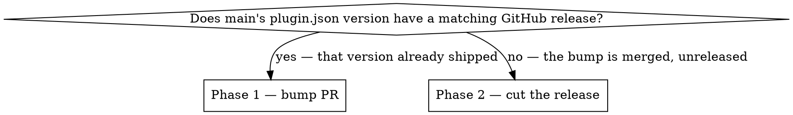

# Release this plugin

Claude Code resolves this plugin's version from `version` in `.claude-plugin/plugin.json`
and uses it as the **update cache key**. Merging to `main` ships nothing: an installed
copy only updates when that string changes. Releasing *is* bumping it.

`package.json` mirrors the same number. `marketplace.json` deliberately has no `version` —
`plugin.json` wins the resolution order, and a second copy is a second thing to forget.

## Which phase you're in



Determine it, don't assume:

```bash
git fetch origin --tags -q
git show origin/main:.claude-plugin/plugin.json | grep '"version"'
gh release list --limit 5
```

## Phase 1 — the bump PR

`main` is protected (review required). Never push the bump straight to `main`.

1. **Collect what's shipping.** `git log --oneline --no-merges <last-release-tag>..origin/main`
   (or since the skeleton if there's no tag yet).
2. **Pick the number.** New command or capability → MINOR. Bugfix or docs-only → PATCH.
   Breaking change to a documented contract (capture exit codes, manifest schema, config
   shape) → MINOR while pre-1.0, MAJOR after. `$ARGUMENTS` may name it (`patch`, `minor`,
   `major`, or an explicit `X.Y.Z`); otherwise propose one.
3. **Show the user the proposed version and the drafted CHANGELOG entry, and wait for
   approval.** A release is outward-facing — this gate is not skippable.
4. Branch `chore/release-X.Y.Z` off `main`, then edit exactly three files:
   - `.claude-plugin/plugin.json` → `"version": "X.Y.Z"`
   - `package.json` → the same string
   - `CHANGELOG.md` → a new `## [X.Y.Z] - YYYY-MM-DD` section, Added / Changed / Fixed,
     written for a plugin *user* (what changed for them), not as a commit log
5. Verify before pushing — `claude plugin validate .`, plus the self-checks in CLAUDE.md
   (`shopify`, `md2html`, `build-site`, `update-check`). Report failures; don't paper over them.
6. Commit, push, `gh pr create`. Stop here — Phase 2 runs after the PR merges.

## Phase 2 — cut the release

Once the bump is on `main`:

```bash
git checkout main && git pull -q
# substitute the real number for X.Y.Z; NOTES can be any scratch path
awk '/^## \[X\.Y\.Z\]/{f=1;next} /^## \[/{f=0} f' CHANGELOG.md > "$NOTES"
gh release create vX.Y.Z --target main --title "vX.Y.Z" --notes-file "$NOTES"
```

`gh release create` **creates the tag itself** on `--target`. Do not `git tag` and push a
tag by hand — that's a second source of truth for the same commit.

Then `git fetch --tags origin` to pick the new tag up locally, and
`gh release view vX.Y.Z` to confirm what users see.

## What the tag does not do

The marketplace source is `"./"` in a git-hosted marketplace, so users track `main`'s tip.
Delivery happens when the resolved version differs from what's installed — the tag and
release are documentation and a rollback point, not a channel. Never tell the user a
release is "live" for them because a tag exists; it's live because `plugin.json` changed
on `main`.

Users pull it with `/plugin marketplace update shopify-apps-doc-writer` then
`/plugin update shopify-apps-doc-writer@shopify-apps-doc-writer`, or on the next
background refresh.

## Common mistakes

| Mistake | What happens |
|---|---|
| Merging a feature without bumping | Ships to nobody. `/plugin update` says "already at the latest version". |
| Bumping `plugin.json` only | `package.json` drifts; the two disagree about what this release is. |
| Adding `version` to `marketplace.json` | A second place to forget. `plugin.json` wins anyway. |
| `git tag` + `gh release create` | Duplicate tag sources. Let the release create it. |
| Claiming the release reached users | Unverifiable from here. Say it's published; the update is theirs to pull. |
