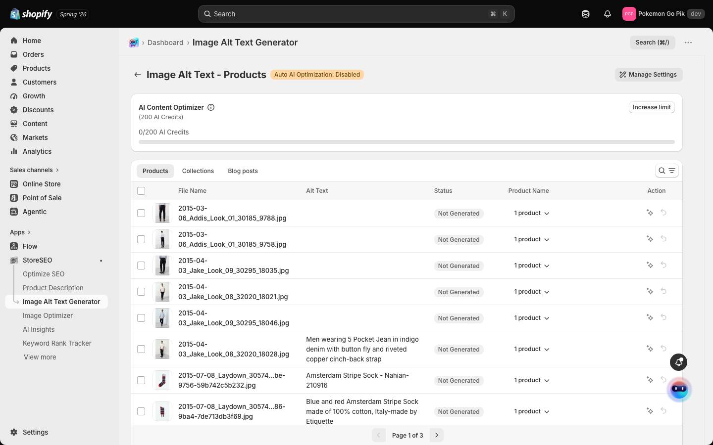
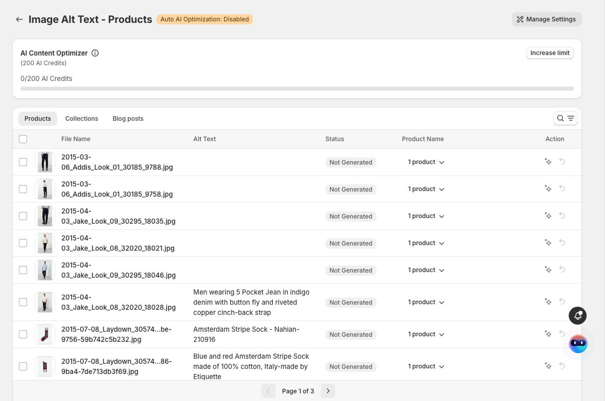
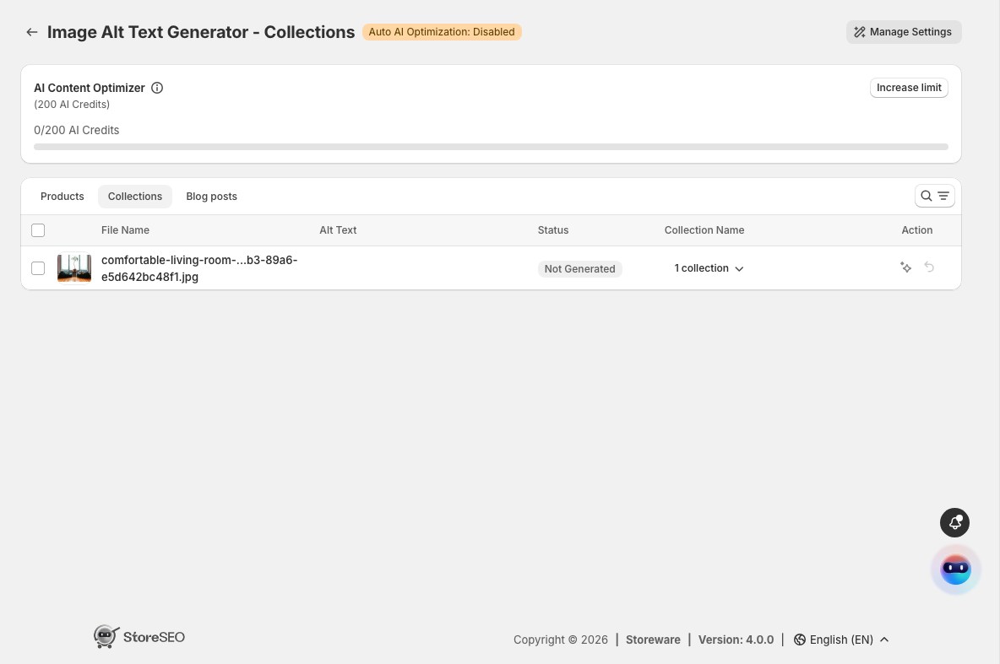
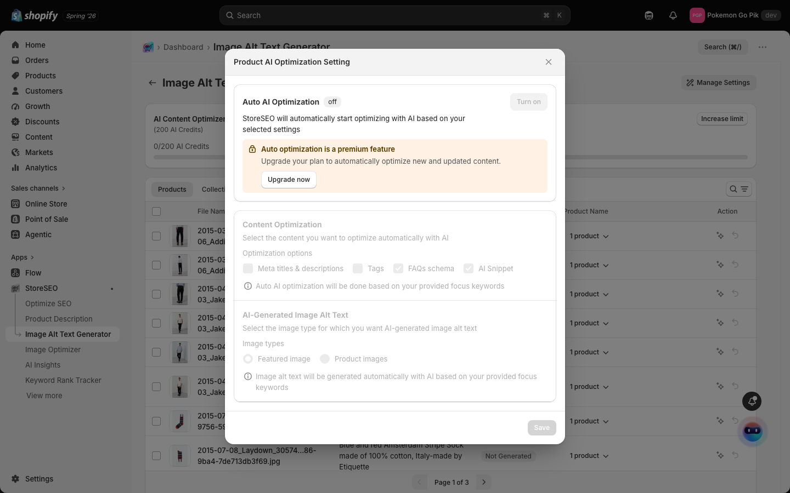

# Image Alt Text Generator

> Give every product image a clear, descriptive alt text so search engines and screen readers understand what you're selling.

## Overview

Alt text describes what's in an image. Search engines use it to understand and rank your images, and screen readers read it aloud to shoppers who can't see the picture. Most stores have hundreds of images with no alt text at all, because writing it by hand is slow.

**Image Alt Text Generator** lists every image in your store, shows you which ones are missing alt text, and writes alt text for them using AI. You review the result before it goes live, and you can restore the previous value at any time.

The feature covers three kinds of images, each on its own tab: **Products**, **Collections**, and **Blog posts**.

Image Alt Text Generator requires the **AI Content Optimizer** add-on on your subscription. Without it, the page shows an upgrade prompt instead of your images.

## Prerequisites

- The **AI Content Optimizer** add-on, active on your StoreSEO subscription.
- Available **AI Credits**. Your balance is shown at the top of the page, for example `0/200 AI Credits`.
- Your products synced into StoreSEO. If you've never used the feature, the list starts empty.

## How do I add alt text to my product images?

1. From your Shopify admin, open **Apps → StoreSEO**, then select **Image Alt Text Generator** in the StoreSEO menu.

   

2. If the page says your products need to be added or synced first, select **Sync products**. StoreSEO pulls in your product images. You only need to do this the first time.

3. Review the list. Each row shows the image thumbnail, its **File Name**, its current **Alt Text**, a **Status** of `Not Generated` when no alt text exists yet, and the **Product Name** the image belongs to.

   

4. To write alt text for a single image, select the generate icon in that row's **Action** column. StoreSEO generates a description from the image and the product it belongs to, and spends AI Credits to do it.

5. To handle several images at once, tick the checkboxes on the rows you want — or the checkbox in the header to select the whole page — and use the bulk action that appears.

6. Check the generated text in the **Alt Text** column before you move on. If you don't want a result, use the restore icon in the **Action** column to put the previous value back.

Use the search and filter controls above the table to find specific images, and the page arrows at the bottom to move through your catalogue.

## How do I add alt text to collection and blog images?

Switch to the **Collections** or **Blog posts** tab at the top of the list. Both work exactly like the Products tab — same columns, same **Action** controls — but list your collection images and blog post images instead.

## Can StoreSEO write alt text automatically?

Select **Manage Settings** in the top right to open **Product AI Optimization Setting**. With **Auto AI Optimization** turned on, StoreSEO optimizes new and updated content for you instead of waiting for you to select each image. Under **AI-Generated Image Alt Text** you choose which images this applies to: **Featured image** or **Product images**.

Automatic optimization is a premium feature. If your plan doesn't include it, the settings appear greyed out with an **Upgrade now** prompt, and you can still generate alt text manually from the list.

## Frequently asked questions

### What is image alt text?

Image alt text is a short written description of what an image shows. Search engines read it to understand pictures they can't otherwise interpret, which is how your products become eligible to appear in image search. Screen readers read it aloud, so shoppers with visual impairments know what's in the photo. It's also the text a browser displays if the image fails to load.

### Why is my image list empty?

Your products haven't been synced into StoreSEO yet. Select **Sync products** on the Image Alt Text Generator page, and your images appear once the import finishes. You only need to do this the first time.

### Why does StoreSEO say Image Alt Text Generator is not enabled?

Image Alt Text Generator is part of the **AI Content Optimizer** add-on, so it stays locked until that add-on is on your subscription. Add it from the upgrade prompt shown on the page, and the image list replaces the prompt.

### What are AI Credits, and what happens when I run out?

AI Credits are the allowance StoreSEO spends when it generates content for you, including image alt text. Your balance sits at the top of the Image Alt Text Generator page as a running total such as `0/200 AI Credits`. When you need more, select **Increase limit**.

### Does generating alt text change my product images?

No. Generating alt text only writes the image's description — the image file itself is never modified, resized, or replaced. If you don't want a generated description, the restore icon in the **Action** column puts the previous value back.

### Can I add alt text to collection and blog post images?

Yes. Collection images and blog post images have their own tabs, **Collections** and **Blog posts**, at the top of the image list. Both work exactly like the **Products** tab, with the same columns and the same **Action** controls.

## Troubleshooting

**The page shows an upgrade prompt instead of my images**
Cause: the **AI Content Optimizer** add-on isn't on your subscription.
Fix: add it from the prompt on that page, then reload.

**The list is empty and asks me to sync**
Cause: your products haven't been imported into StoreSEO yet.
Fix: select **Sync products** and wait for the import to finish, then reload the page.

**Auto AI Optimization is greyed out and won't turn on**
Cause: automatic optimization is a premium feature that your current plan doesn't include.
Fix: select **Upgrade now** in the settings dialog, or keep generating alt text manually from the list — that works on your current plan.
