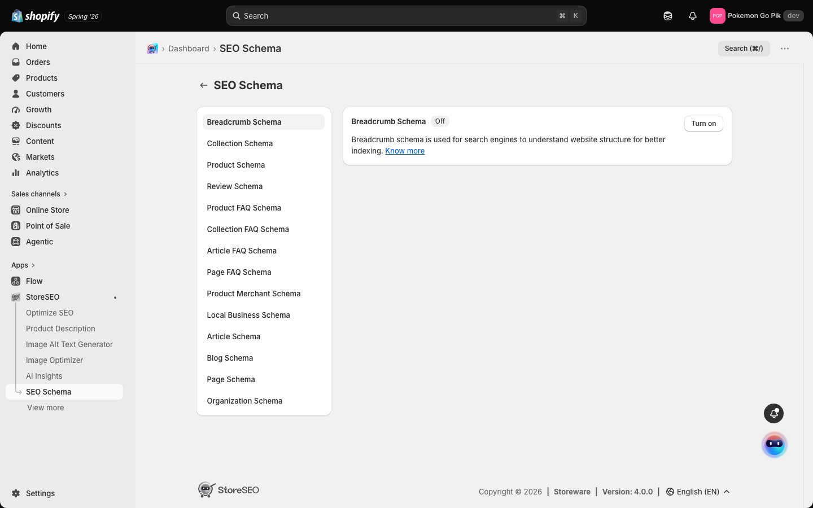
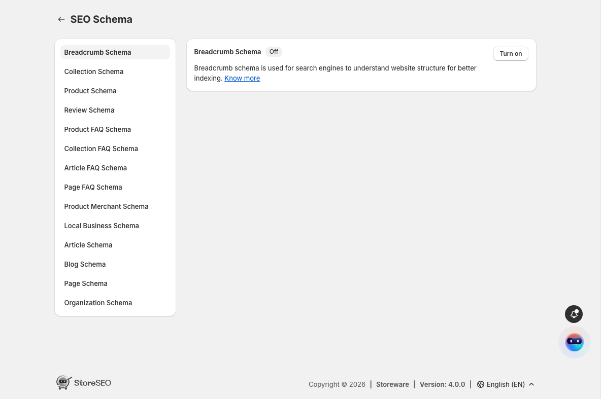
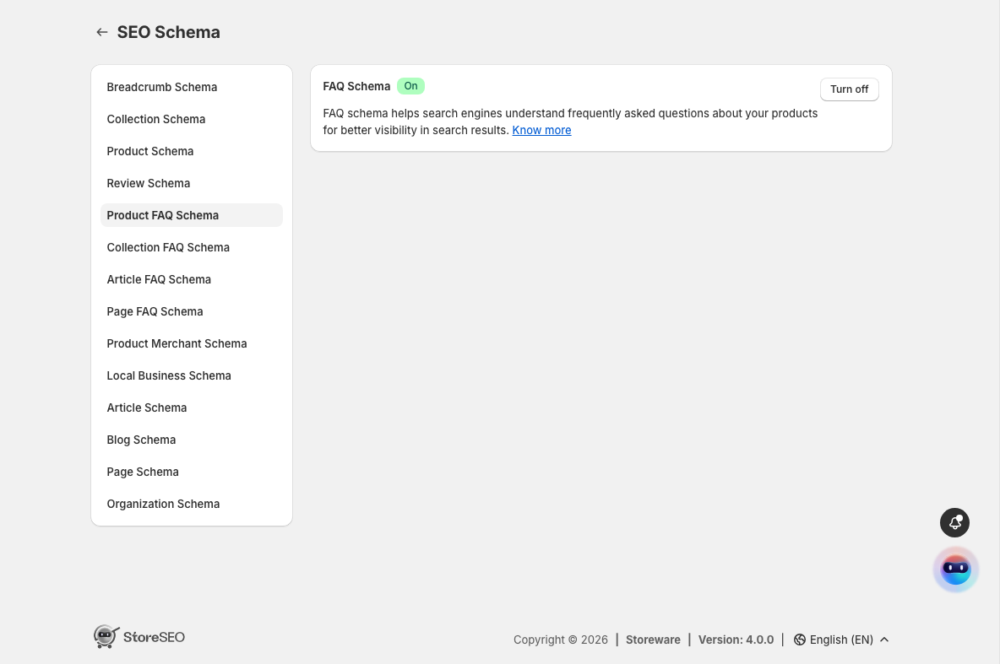
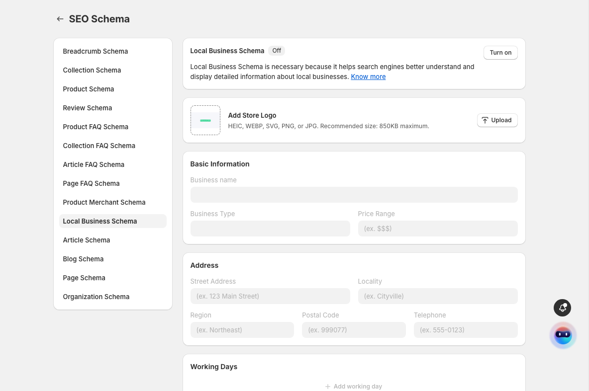

# SEO Schema

> Add structured data to your store so search engines can show rich results — star ratings, FAQs, breadcrumbs — for your pages.

## Overview

Schema markup is extra information added to your pages in a format search engines read directly. It doesn't change how your store looks to shoppers; it tells Google, Bing, and AI answer engines exactly what each page is — a product, a review, an FAQ, a local business — so they can display richer results, like star ratings under a product or a set of questions beneath a link.

**SEO Schema** lets you turn these on without editing any theme code. Every schema type StoreSEO supports is listed on one page: pick a type, read what it does, and switch it on. A few types ask for a little extra information first.

You manage all schema types from the **SEO Schema** page in the StoreSEO menu.

## How do I turn on a schema type?

1. From your Shopify admin, open **Apps → StoreSEO**, then select **SEO Schema** in the StoreSEO menu.

   

2. Choose a schema type from the list on the left — for example **Breadcrumb Schema**, **Product Schema**, or **Review Schema**. Its details open on the right, with a short description of what it does and an **On**/**Off** badge showing its current state.

   

3. Select **Turn on**. The badge changes to **On**, and the button becomes **Turn off** so you can reverse it at any time. Select **Know more** in any schema's description to read more about it.

Each schema type is independent — turning one on doesn't affect the others.

## What does an enabled schema look like?

An enabled schema shows an **On** badge and a **Turn off** button. In the example below, **Product FAQ Schema** is switched on.

To switch a schema off again, open it from the list and select **Turn off**.

## Which schemas need extra details?

Most schema types are a single switch. A few — **Local Business Schema** and **Organization Schema** — describe your business, so they ask for that information before you turn them on.

1. Select the schema from the list. Below the description you'll see fields for your business details.

   

2. Add your **Store Logo** with **Upload** (HEIC, WEBP, SVG, PNG, or JPG, up to 850KB), then fill in the **Basic Information** — business name, type, price range — and your **Address** and contact details. Add your opening hours under **Working Days**.

3. Select **Save**, then **Turn on**.

## FAQ

### What is schema markup?

Schema markup is structured data added to your pages in a standard format (JSON-LD) that search engines read directly. It describes what a page is — a product, an article, a review, a local business — so search engines and AI answer engines can understand it precisely and display richer results for it.

### Which schema types can I add?

StoreSEO's SEO Schema page lists them all in one place, including Breadcrumb, Collection, Product, Review, Product FAQ, Collection FAQ, Article FAQ, Page FAQ, Product Merchant, Local Business, Article, Blog, Page, and Organization schema. Each has a short description explaining what it does.

### Do I need to edit my theme to add schema?

No. StoreSEO adds the schema markup for you when you turn a type on. You never touch theme code — turning a schema on from the SEO Schema page is all that's needed.

### Will turning on schema change how my store looks?

No. Schema is invisible to shoppers browsing your store. It only affects how search engines read your pages and what they can display in search results.

### How do I turn a schema off?

Open that schema type from the list on the left and select **Turn off**. Its badge returns to **Off**. Each type is switched on and off independently.

### Why don't I see rich results in Google yet?

Turning a schema on makes your pages eligible for rich results, but search engines decide when and whether to show them, and they need to re-crawl your pages first. This can take days to weeks, and rich results are never guaranteed even when the schema is valid.

## Troubleshooting

**I turned a schema on but nothing changed in my store**
Cause: schema is metadata for search engines, not a visible feature.
Fix: this is expected — schema never changes your storefront's appearance. Its effect shows up in how search engines read and display your pages over time.

**Local Business or Organization schema won't turn on**
Cause: these schemas need your business details filled in first.
Fix: complete the **Basic Information** and **Address** fields, select **Save**, then **Turn on**.
